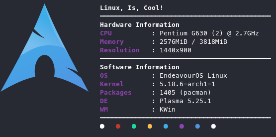
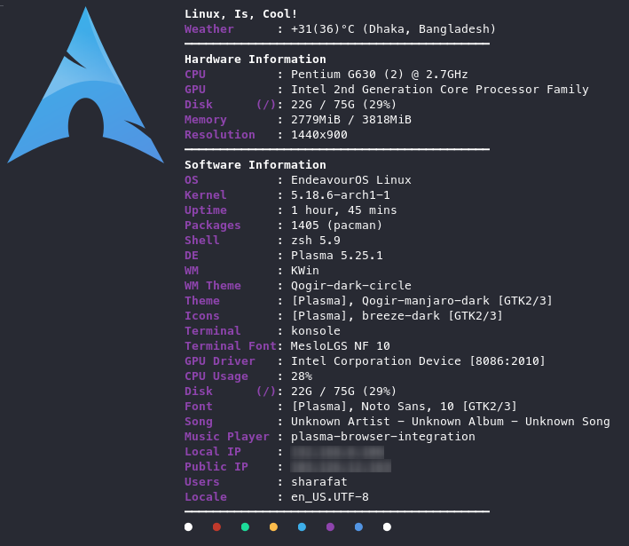
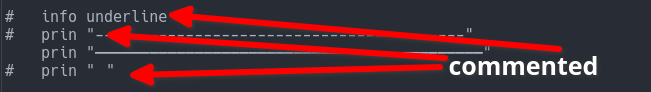
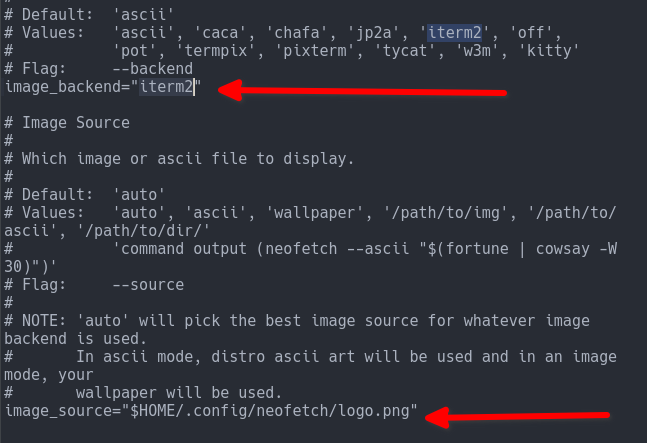

# Neofetch Customization

A simple way to **beautify** your **neofetch**!

**Quick Access**

- [What is neofetch?](#neofetch-short)
- [Neofetch Customization](#customization)
- [One Click Install](#one-click-installation)
- [Manual customization](#manual-customization)
- [Easy way to customize](#easy-way-to-customize)
- [Editing the configuration file](#editing-the-configuration-file)
- [Font/ Icon missing issue](#icon-missing-issue)
- [Remove](#remove)
- [Backup and Restore](#backup-and-restore)
- [Resetting the neofetch](#reset)
- [FAQ](#faq)
- [Credits](#credits)
- [Special thanks to](#special-thanks-to)

---

## Neofetch (short intro)


Neofetch is a command-line system information tool written in `bash 3.2+`. Neofetch displays information about your operating system, software and hardware in an aesthetic and visually pleasing way.

### More: [[GitHub](https://github.com/dylanaraps/neofetch)] \[[Dependencies](https://github.com/dylanaraps/neofetch/wiki/Dependencies)\] \[[Installation](https://github.com/dylanaraps/neofetch/wiki/Installation)\] \[[Wiki](https://github.com/dylanaraps/neofetch/wiki)\]

## Customization


Default neofetch looks like this one,

we can just go ahead and modify it like this one,


## One Click Installation

To install with just one command, run the following executable!

```
wget -O neofetch-setup.sh https://raw.githubusercontent.com/SharafatKarim/neofetch-customization/master/setup.sh && bash neofetch-setup.sh && rm neofetch-setup.sh
```
To confirm successful installation, run,
```
wget -O neofetch-setup.sh https://raw.githubusercontent.com/SharafatKarim/neofetch-customization/master/status.sh && bash neofetch-setup.sh && rm neofetch-setup.sh
```
And if you don't like then go back to the previous state, by running,
```
wget -O neofetch-setup.sh https://raw.githubusercontent.com/SharafatKarim/neofetch-customization/master/remove.sh && bash neofetch-setup.sh && rm neofetch-setup.sh
```
## Manual Customization


You just have to edit a config file in your home directory, simple!
`.config/neofetch/config.conf`
To open that file in a text editor, you can also run the command,

```
xdg-open "$HOME/.config/neofetch/config.conf"

```
or, using nano,
```
nano "$HOME/.config/neofetch/config.conf"

```
#### See this [wiki](https://github.com/dylanaraps/neofetch/wiki/Customizing-Info) page for more info.

## Easy way to customize


Easier way to customize is to use other's config file. In this case, check this GitHub [repo](https://github.com/Chick2D/neofetch-themes).

And you can also customize like me,



You just have to use my config file and tweak it a little bit.
In the config file.

## Editing the configuration file

By using config files, you can add or remove options, titles and unlock a lot more! Just like this image,



In the config file, there are some lines starting with #

,and there are some lines which are not started with # called commented lines. Those lines will not

Those lines starting with # is just for you. They'll have no effect in the neofetch. They are used for you to easily understand.

Now you'll notice I've divided that config wihtin 2 parts. First part controls which contents are displayed beside your logo.

In the first part, remove the # sign from a line, then it'll show up in the terminal. Now it's upto you to do further customization.

Now's the second part. If you want to switch back to the ascii arts then you have set
`image_backend="iterm2"`



and if you feel like using your own custom logo, change the location, `image_source="$HOME/.config/neofetch/logo.png"`

If your logo is too much small, change the value of `image_size="none"` to `image_size="auto"`

## Icon missing issue


It's generally related to your fonts.

My config file should work out of the box, with most of the fonts. But in case, any symbol is broken or if your'e unable to read everything clearly, then consider using nerd patched fonts. They'll definitely work!

- [Nerd fonts website.](https://www.nerdfonts.com/)
- [Read more on how to setup fonts in different terminal emulator.](https://github.com/romkatv/powerlevel10k#fonts)

## Remove

If you have used the script to install theme and want to go back to previous state, run, 
```
wget -O neofetch-setup.sh https://raw.githubusercontent.com/SharafatKarim/neofetch-customization/master/remove.sh && bash neofetch-setup.sh && rm neofetch-setup.sh
```

## Backup and Restore

Just copy the `neofetch` folder or the config file `config.conf` from `.config` ("$HOME/.config" - hidden folder) and keep it somewhere safe. Then return to it's original home.


If you used [One Click Install](#one-click-installation), check your current status by running,
```
wget -O neofetch-setup.sh https://raw.githubusercontent.com/SharafatKarim/neofetch-customization/master/status.sh && bash neofetch-setup.sh && rm neofetch-setup.sh
```
It'll show you, `config-backup is installed`

## Reset


Default neofetch config file can be found [here](https://github.com/dylanaraps/neofetch/wiki/Config-File), or just delete the neofetch directory from "$HOME/.config" dierectory.

Optional,

For confirmation, check your current status by running,
```
wget -O neofetch-setup.sh https://raw.githubusercontent.com/SharafatKarim/neofetch-customization/master/status.sh && bash neofetch-setup.sh && rm neofetch-setup.sh
```
It'll show you, 
`you're using the default neofetch`

## FAQ


No questions were asked, yet! To ask any quetion, feel free to write me or crete an issue.

## Credits

- [Neofetch](https://github.com/dylanaraps/neofetch)
- [Nerd fonts](https://www.nerdfonts.com/)
- [powerlevel10k](https://github.com/romkatv/powerlevel10k)
- [Chick2D](https://github.com/Chick2D/neofetch-themes)

## Special thanks to

- [Shahid Parvez](https://mrsnailo.github.io/)